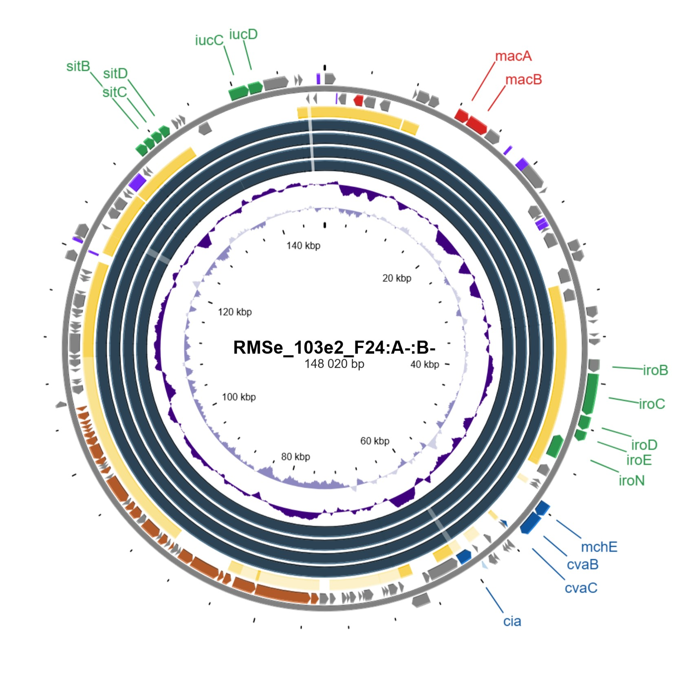
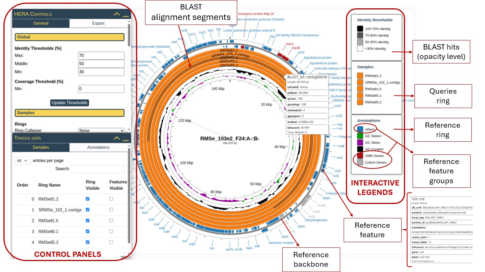

# HERA: Host-Element Reference-based Aligner

The webserver for **plasmid visualization** using BLAST alignment against reference sequences.

• user-friendly 
• no manual file preparation 
• real-time changes 
• annotation 
• automatic reference selection 

 

# Webserver
**No installation** is required. Simply upload your input files in fasta or GenBank format and everything is handled for you within <a href="https://web.ccb.uni-saarland.de/hera/">the <strong>HERA web server</strong></a>. No manual modification of the files or numerous number of clicks before you get the image. Powered by CGView.js, D3.js, and jsPanels.js. Real-time modification of the plasmid map within control panels. 

# Fast tutorial

# Issues
We are actively working on functionality of the web server, extending its features, improving the user experience and fixing potential bugs. If you have anything to report, you would appreciate some new feature or have some ideas, do not hesitate to leave us feedback. 
